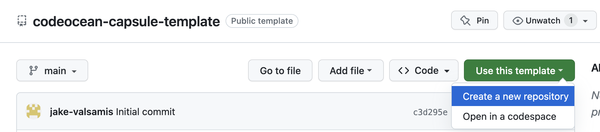
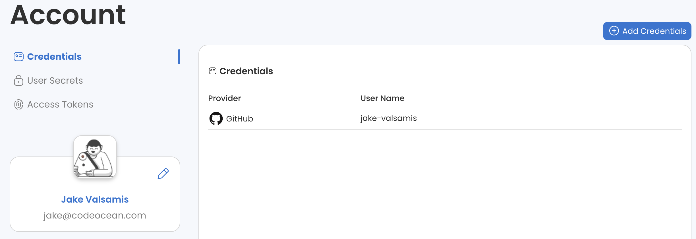
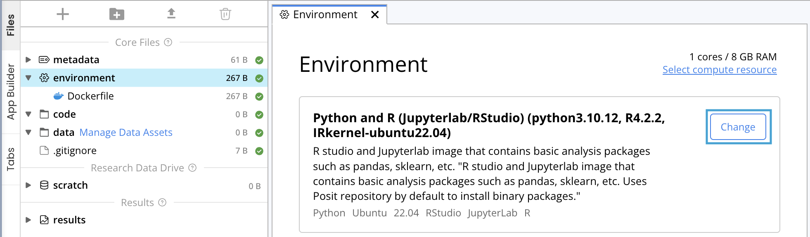

# Code Ocean Capsule Template 🌊

This repository serves as a starting point for creating [Code Ocean](https://codeocean.com) capsules via GitHub import. The capsule defined here uses a Python environment by default, but can easily be switched to R, C++, or any of the other supported [starter environments](https://help.codeocean.com/en/articles/1197876-selecting-a-base-environment) after importing to Code Ocean.

_Note: do **not** import this repository directly. Instead, use this repository as a template to create a new capsule._

## Usage

1. Create a new repository from this template:

    

    In the following screen, you can choose a name for your repository and optionally enter a description. You can add the `-capsule` suffix to your repository name to make it easier to identify.

1. In your newly created repository, update the [`metadata/metadata.yml`](metadata/metadata.yml) file with the name and description of your capsule. You can also update the `authors` field with your name.

1. Ensure that your GitHub credentials have been added to your Code Ocean account:

    

    _See the [Git provider integration guide](https://docs.codeocean.com/user-guide/git-provider-integration-guide/setting-up-the-integration) for instructions._

1. In Code Ocean, click the + symbol in the left sidebar to create a new capsule, then click "Clone from Git":

    

1. In the pop-up dialog, enter the URL of the GitHub repository you created in step 1. Click "Clone". Once the clone is complete, you will be taken to the capsule IDE where you can view the code, add data, and perform reproducible runs.

1. Update the code to perform analysis and test it by running it on data! All analysis code should go in the `code/` directory, and results should always be written to `/results`. (Note the leading slash! Code Ocean expects results files to be placed in a `results` directory at the _root of the file system_.) You can also update the entry point of your capsule by updating the [`code/run`](code/run) executable file.

## Changing the Runtime Environment

If your capsule requires a runtime different than the default Python one, you can change the environment in Code Ocean after completing the steps above. 

1. Open your capsule in the Code Ocean IDE.

2. In the Files pane on the left side of the IDE, select "environment" (located under "Core Files").

3. In the main editor, under the "Environment" section, click the "Change" button:

    

4. Select your desired runtime environment. Note that this will update `environment/Dockerfile`, which you should commit and push back to the GitHub repository.
